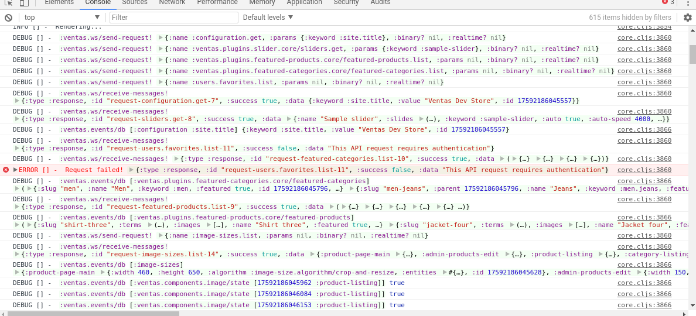

## Development workflow

The first thing I do when I want to develop ventas, is bringing up my local environment:

```bash
$ docker-compose up -d
```

Then, I open Cursive, and start a REPL (just a regular leiningen repl, but inside Cursive).

When the REPL starts, I load the code and start the mount system:

```bash
> (init)
```

When I've changed backend code and I want it to be reloaded, I execute this:

```clojure 
> (repl/r)
```

For frontend development I execute:

```
shadow-cljs watch  :admin
lein sass4clj auto
```

### CLJS gotchas

#### Devtools custom formatters

It is very important that you [enable custom formatters in Chrome](https://github.com/binaryage/cljs-devtools/blob/master/docs/installation.md#enable-custom-formatters-in-chrome) to easily debug the application.

If you don't see this in your console, something is wrong:




### CLJ gotchas

#### Exceptions while reloading

Sometimes, your code has a syntax error, you reload it and, suddenly, it seems you can't do anything anymore:

```clojure
(repl/r)
:reloading (repl user ventas.server.api ventas.server.api.admin ventas.server.api.user ventas.server.api.description ventas.plugins.featured-categories.core ventas.plugins.slider.core ventas.plugins.blog.core ventas.plugins.featured-products.core ventas.core ventas.database-test)
:error-while-loading repl
             java.lang.RuntimeException: Unable to resolve symbol: doesnotexist
(repl/r)
             java.lang.RuntimeException: No such var: repl/r
clojure.lang.Compiler$CompilerException: java.lang.RuntimeException: No such var: repl/r, compiling:(/tmp/form-init1507582247396403063.clj:1:1)

```

The solution to this is moving to the REPL namespace and executing the refresh function:

```clojure
(in-ns 'repl)
(tn/refresh)
;; alternatively...
(clojure.tools.namespace.repl/refresh)
```

You can keep reloading this way until you solve the error.

If that doesn't work, you can try `clojure.tools.namespace.repl/refresh-all`.

#### Database changes

You can register a migration or create an entity type to alter the db schema.

To register a migration:

```clojure
(ventas.database.schema/register-migration!
 ::my-migration
 [{:db/ident :some/stuff
   :db/valueType :db.value/string
   :db/cardinality :db.cardinality/one}])
```

To apply the registered migrations:

```clojure
(ventas.database.schema/migrate)
```

Entity types are described [here](./Entity_types.md)

### SASS

This project roughly follows BEM.

To add a new file, you need to add it to `scss/main.scss`.